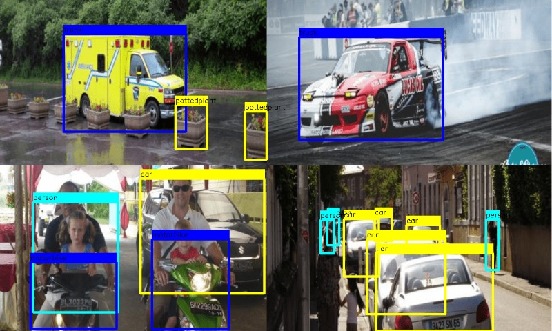
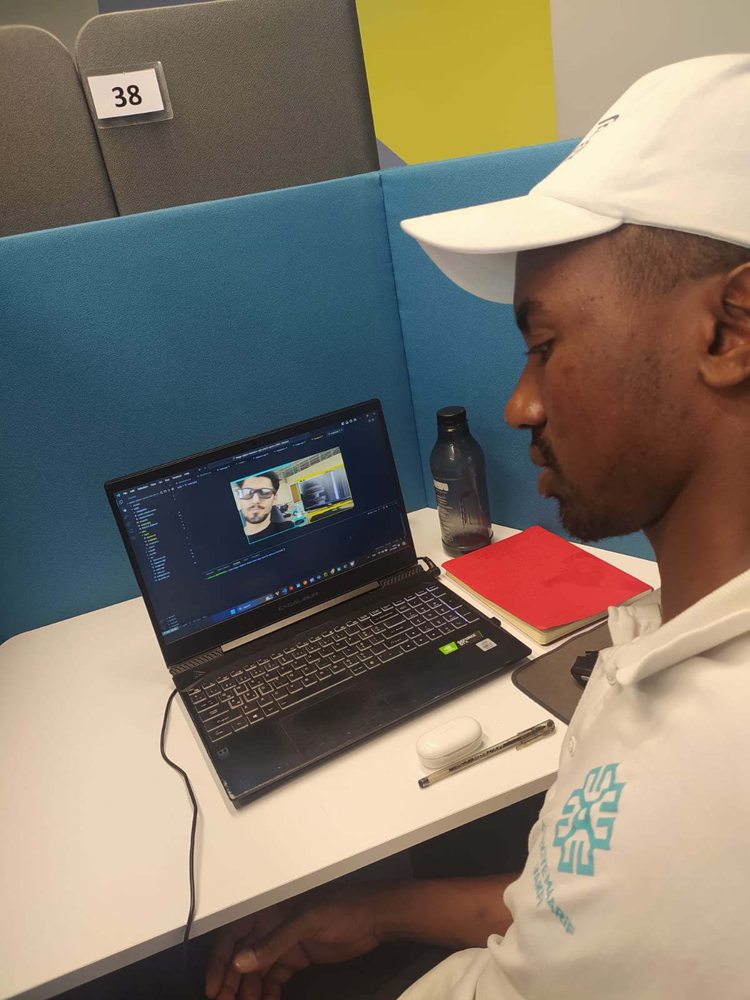
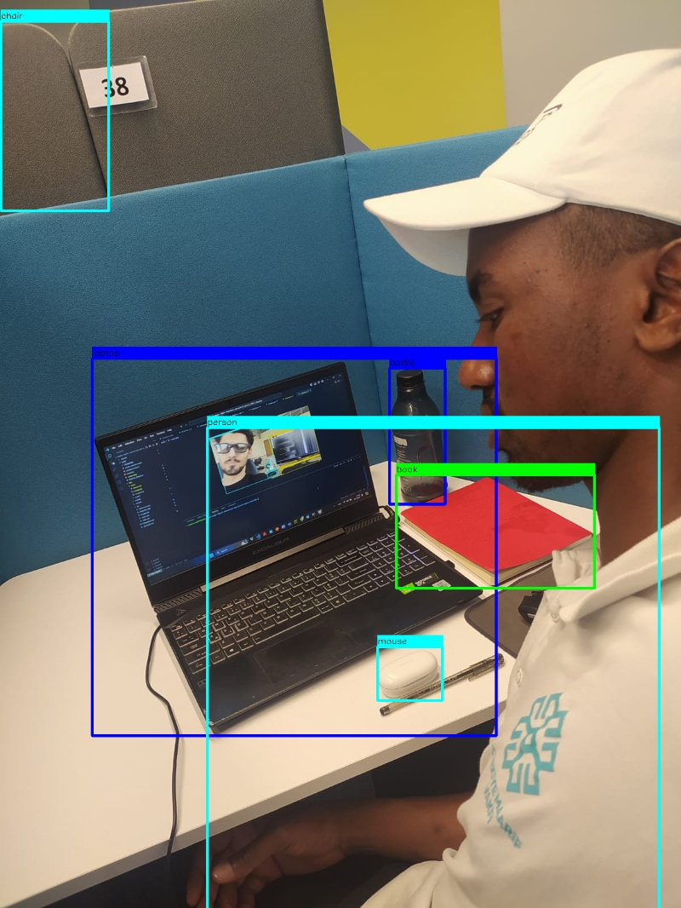

# YOLOv5 Object Detection with C++ and OpenCV



## Introduction


This is a project to demonstrate the use of YOLOv5 with cpp and opencv to detect objects in a given image input.
YoloV5 is a powerful object detection model that can be used in various applications such as autonomous vehicles, security systems, and many more.
This project uses the YOLOv5 model to detect objects in an image and display the output with bounding boxes around the detected objects.

## Requirements

- Python 3.8 and above
- OpenCV 4.5.4 and above
- CMake
- YOLOv5 5.0
- GCC 6.3.0


## Installation

1. Clone the repository
2. Install OpenCV - follow the this link: 
    https://docs.opencv.org/master/d7/d9f/tutorial_linux_install.html
3. Install CMake - follow the this link: 
    https://cmake.org/download/
4. Install YOLOv5 - follow the this link: 
    https://sourceforge.net/projects/yolov5.mirror/files/v7.0/yolov5m.onnx/download


## Usage


Run the following commands:
```
mkdir build
cd build
cmake ..
make
./YOLOv5_Detector
```
3. The output will be displayed in the data folder.


## Testing


| Input Image                            | Output Image                          |
|----------------------------------------|---------------------------------------|
|  |  |


## Conclusion
The project demonstrates the use of YOLOv5 with cpp and opencv to detect objects in a given image input. The project can be further extended to detect objects in a video stream or a live feed from a camera. 

## References

- https://docs.ultralytics.com/models/yolov5/
- https://learn.microsoft.com/en-us/vcpkg/get_started/get-started-vscode?pivots=shell-cmd
- https://docs.opencv.org/4.x/d3/d52/tutorial_windows_install.html
- https://github.com/RsGoksel/Cpp-Object-Detection-Yolov5-OpenCV